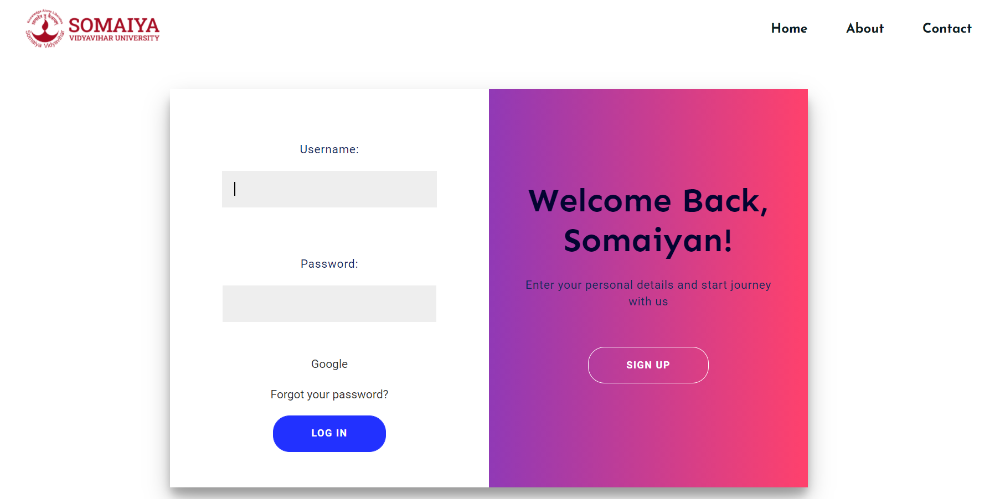
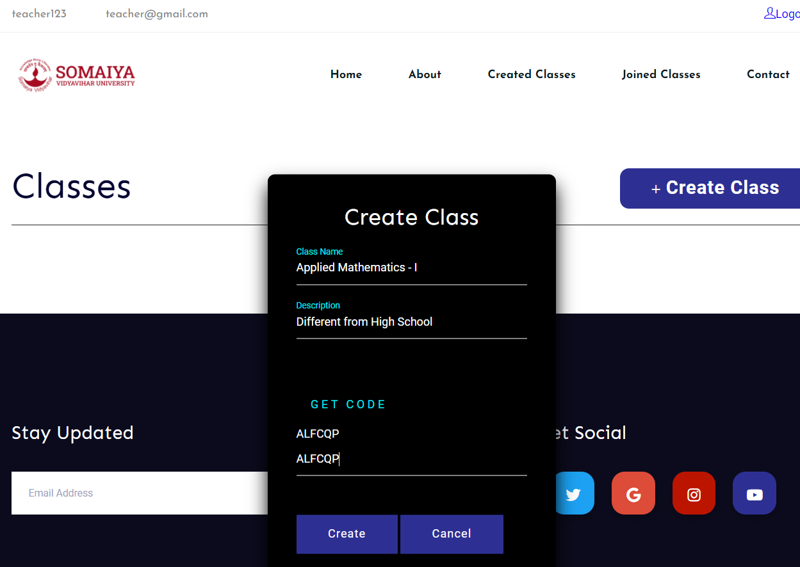
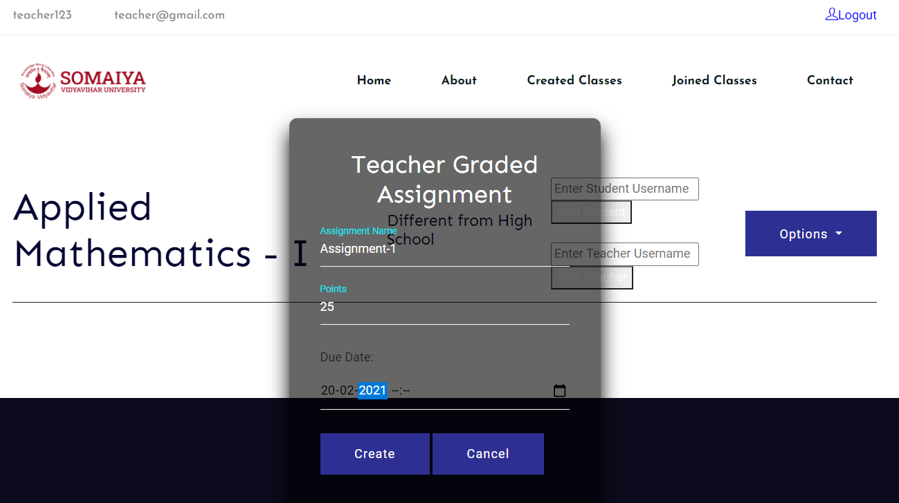

# Peergrade-internship

A tool to be used by teachers to assess students and assign students to grade their peers. This is created using <a href = "https://docs.djangoproject.com/en/3.1/"> ***Django***</a>, HTML, CSS, JS and <a href = "https://www.postgresql.org/"> ***PostGreSQL***</a> for handling classes in the backend. 

The ***functionalities*** provided in the project are:
* Student and Teacher Registration/ Login<br>
<br>
* Muliple teachers in a class
* Creating and Joining Classes using _class code_<br><br>
<br>
<br>
* Adding students without using _class code_
* Creating assignments, notices for teachers <br>
<br>
* Submitting assignments for students
* Alotting peers to review assginments
* Review by the teacher itself
* Displaying aggregated mark
* Evaluation and Feedback by students

To install the dependencies, use:
```bash
pip install -r requirements.txt
```
